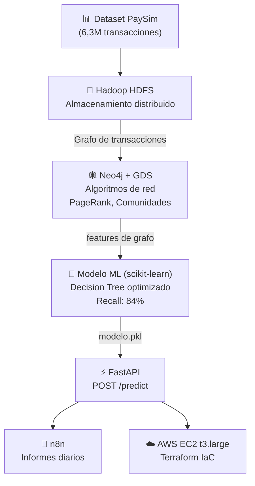

# 🛡️ Sistema Inteligente de Detección de Fraude Bancario

  
  
  
  
  
  
  
  

 

---

## 📖 Descripción del Proyecto

Desarrollo de un sistema de detección de fraude que abarca el ciclo de vida completo del dato: ingesta masiva, análisis de grafos, modelado predictivo, puesta en producción y automatización de alertas.

La detección de fraude bancario presenta tres desafíos técnicos fundamentales: el desbalanceo extremo de las clases, la naturaleza relacional del delito (patrones de red) y la necesidad de latencias bajas para su aplicabilidad operativa.

Para abordar estos problemas, se ha diseñado una arquitectura Big Data basada en los siguientes componentes:

1. 🗄️ **Almacenamiento Distribuido**: Ingesta de 6.3 millones de transacciones (dataset *PaySim*) sobre Hadoop HDFS y PySpark.
2. 🕸️ **Feature Engineering Relacional**: Extracción de características topológicas mediante Neo4j (PageRank, centralidad, detección de comunidades) para revelar redes de blanqueo.
3. 🧠 **Machine Learning Supervisado**: Clasificación mediante Decision Tree optimizado, maximizando la métrica PR-AUC y el Recall.
4. ⚡ **Despliegue y Automatización**: Inferencia en tiempo real expuesta vía FastAPI, con un orquestador (n8n) que genera reportes de incidentes mediante IA generativa.
5. ☁️ **Infraestructura como Código (IaC)**: Entorno contenerizado provisionado en AWS mediante Terraform.

---

## 🏗️ Arquitectura del Sistema

El diseño funcional de los microservicios se encuentra segmentado en contenedores independientes:
* 🔵 **Neo4j**: Base de datos de grafos para la persistencia y análisis topológico.
* 🟡 **Hadoop (HDFS + YARN)**: Motor de persistencia distribuida.
* 🟠 **JupyterLab**: Entorno de experimentación y transformaciones de datos.
* 🟢 **FastAPI**: Microservicio para la evaluación de inferencia.
* 🟣 **n8n**: Orquestador de flujos de automatización.

---

## 🧠 Flujo de Desarrollo

El proceso algorítmico y de entrenamiento está estructurado secuencialmente en los siguientes cuadernos:

* 📓 **[Fase 1: Ingesta con Hadoop y PySpark](./notebooks/hadoop_pyspark_ingesta.ipynb)**
* 📓 **[Fase 2: Feature Engineering y Análisis de Grafos](./notebooks/01_Feature_Engineering_Graph.ipynb)**
* 📓 **[Fase 3: Modelado Predictivo de Fraude](./notebooks/02_Modelado_Deteccion_Fraude.ipynb)**

---

## 🏦 Validación en Producción Simulada: Weft Neobank

Para probar el sistema de detección de fraude en condiciones que simulan fielmente la realidad operativa de una entidad financiera, la API predictiva ha sido integrada con **[Weft](https://github.com/ZuhirDev/Weft)**. 

**[Weft](https://github.com/ZuhirDev/Weft)** es un neobanco digital diseñado para operar, permitiendo a los usuarios gestionar múltiples cuentas y tarjetas sin necesidad de sucursales físicas. La plataforma soporta depósitos, retiros y transferencias procesadas en tiempo real mediante *WebSockets*.

La integración de este proyecto con Weft ha permitido **evaluar cada transacción al instante** y comprobar la eficacia del modelo. Al conectar ambos sistemas, cualquier operación anómala o riesgo de fraude es detectado con baja latencia.

---

## 📚 Documentación Técnica

La documentación del proyecto se divide por áreas de dominio en el directorio principal:

* 📑 **[Memoria Principal del Proyecto](./docs/MEMORIA.md)**: Motivación, análisis, metodología, métricas de validación y conclusiones.
* ⚙️ **[Pipeline de Ingesta](./docs/PIPELINE_INGESTA.md)**: Diagrama de interconexión del flujo de datos.

**Configuración e Infraestructura:**
* ☁️ **AWS & IaC**: [Provisión en AWS](./docs/AWS.md) e Infraestructura como Código con [Terraform](./docs/TERRAFORM.md)
* 🚀 **Despliegue**: [Plan General de Despliegue](./docs/PLAN_DESPLIEGUE.md)
* 🐳 **Docker**: [Arquitectura de Contenedores](./docs/DOCKER.md)
* 🐘 **Big Data**: [Despliegue del Clúster Hadoop](./docs/HADOOP.md)
* 🔄 **Automatización**: [Módulo de Automatización n8n](./docs/N8N.md)

---

## 🧑‍💻 Autores

- 👨‍💻 [@Poempollo](https://github.com/Poempollo)
- 👨‍💻 [@ZuhirDev](https://github.com/ZuhirDev)
